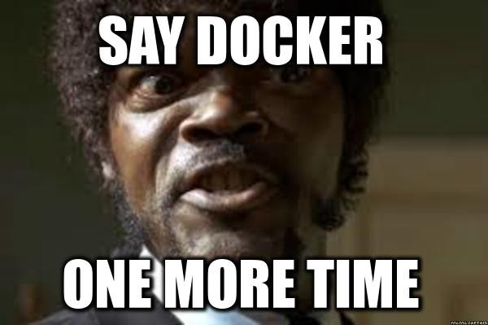

### 왜 CS를 하고 있냐

기업과제를 Docker로 배포하다 보니 Docker에서 Dev와 배포를 해야하는 상황이 생겼다

기존의 remote ssh 로 개발하지 않고 docker-compose를 사용해서 개발 환경을 구축했고 pycharm이 service 2 이기 때문에 다른 버전들과 몇가지 에러가 발생하였다.

그래도 역시 Docker는 좋으니 어느 환경에서도 docker-compose.yml만 공유된다면 개발가능한 PC가 되도록docker-compose를 짜보자



전체적인 Compose 모습은 이렇다

```dockerfile
version: '2'

volumes:
  chatbot_data_db_dev: {}
  chatbot_dev_package: {}

services:
  db:
    build:
      context: ./dockerfile
      dockerfile: Dockerfile-mysql
    environment:
      - MYSQL_ROOT_PASSWORD=
    volumes:
      - chatbot_data_db_dev:/var/lib/mysql

  redis:
    image: "redis:4.0.11"
  
  rabbitmq:
    image: "rabbitmq:latest"
    environment:
      - RABBITMQ_USERNAME=
      - RABBITMQ_PASSWORD=

  chatbot:
    build:
      context: ./dockerfile
      dockerfile: Dockerfile-python
    depends_on:
      - db
      - redis
    links:
      - db
      - redis
      - rabbitmq
    command: /start-dev.sh
    volumes:
      - ../Telegram-ERP/main.py:/script/main.py
      - ../Telegram-ERP/requirements.txt:/script/requirements.txt
      - ../Telegram-ERP/requirements-dev.txt:/script/requirements-dev.txt
      - chatbot_dev_package:/usr/local/lib/python3.5/site-packages/
```

지울 건 지우고 차례차례 봐보자

```
version: '2'
```

먼저 version을 정해줘야 한다 현재 2, 2.1, 3이 제일 많이 보이는데 현재 Pycharm이 사용하는 Docker-compose version은 2 이다

Docker-Compose References https://docs.docker.com/compose/compose-file/

여기서 version 별 차이를 확인할 수 있다.

```
volumes:
  chatbot_data_db_dev: {}
  chatbot_dev_package: {}
```

Docker에서 사용하는 volume인데 db하고 package의 경우 down 후 up 하더라도 저장소를 유지하기 위해서다. Volume을 Mount하면 되는거 아니냐는 의문도 생길 수 있지만, Windows나 Mac에서 개발 시, Databases의 경로를 다시 잡아주는건 비효율적이기 때문에 Volume Container를 만들고 거기에 저장하기로 했다.

```
db:
    build:
      context: ./dockerfile
      dockerfile: Dockerfile-mysql
    environment:
      - MYSQL_ROOT_PASSWORD=
    volumes:
      - chatbot_data_db_dev:/var/lib/mysql
```

database 중 mysql 을 사용하는 부분인데 dockerfile을 두개 이상 사용하다 보니, Dockerfile이 한 폴더에 있는게 거슬렸다. 그래서 Dockerfile 폴더를 하나 만들고 build를 했더니! 에러가 떴다.


내 config 파일에서 에러가...

여튼 Docker-compose의 장점은 상대경로도 사용할 수 있다는 점이지만 모든 부분에서 가능한게 아니었다는게 문제였다. build할 Docker file이 다른 곳에 있는 경우 error가 발생했고 context로 상대경로를 잡아준 다음 호출해야 하는 문제였다.

```
chatbot:
    build:
      context: ./dockerfile
      dockerfile: Dockerfile-python
    depends_on:
      - db
      - redis
    links:
      - db
      - redis
      - rabbitmq
    command: /start-dev.sh
    volumes:
      - ../Telegram-ERP/main.py:/script/main.py
      - ../Telegram-ERP/requirements.txt:/script/requirements.txt
      - ../Telegram-ERP/requirements-dev.txt:/script/requirements-dev.txt
      - chatbot_dev_package:/usr/local/lib/python3.5/site-packages/
```

문제가 제일 많았던 챗봇 부분 컨테이너다.

depends_on 을 사용해 db하고 redis가 정상적으로 돌아가기 전에  작동되는걸 막았고 chatbot_dev_package의 경우 pip로 설치된 저장소들을 매번 install 하기 싫어서 만든 package volume이다

물론 글은 짧지만 json parsing 에 따른 에러가 자주 발생해 멘붕을 일으킨다. 아마 jetbrains의 제품군들이 jre parser를 사용하는데 이때 parser가 못읽는 게 아닌가 추측하는데 (docker-compose up -d 하면 정상적으로 동작하는 파일들도 있다.) references 사이트를 잘 찾아가면서 해결하면 풀리는 문제라고 생각한다.